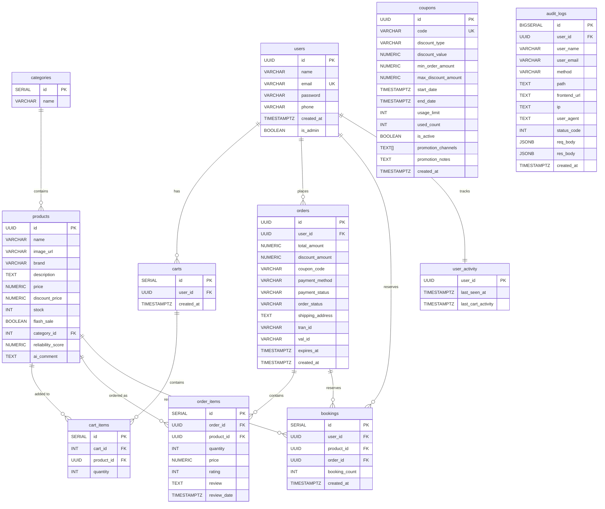

<p align="center">
  <h1 align="center">🛒 Daraz — Full-Stack eCommerce Platform</h1>
  <p align="center">
    A production-ready eCommerce application built with the <strong>PERN stack</strong> (PostgreSQL, Express, React/Next.js, Node.js), fully containerized with Docker and deployed via CI/CD to Azure.
  </p>
</p>

<p align="center">
  
  
  
  
  
  
  
</p>

---

## 🚀 Live Demo

Experience the live, production deployment of the application:

🔗 **URL:** http://samyopramanik.duckdns.org:9000/

> ⚠️ **Note:** The server may take a few seconds to respond on first load due to inactivity (cold start).

---

## 📖 Table of Contents

- [Overview](#-overview)
- [Features](#-features)
- [Tech Stack](#-tech-stack)
- [Architecture](#-architecture)
- [Getting Started](#-getting-started)
  - [Prerequisites](#prerequisites)
  - [Quick Start (Docker)](#quick-start-docker)
  - [Local Development](#local-development)
- [Environment Variables](#-environment-variables)
- [API Reference](#-api-reference)
- [Database Schema](#-database-schema)
- [CI/CD Pipeline](#-cicd-pipeline)
- [Project Structure](#-project-structure)
- [Contributing](#-contributing)
- [License](#-license)

---

## 🌟 Overview

**Daraz** is a feature-rich eCommerce platform inspired by South Asia's leading online marketplace. It provides a complete shopping experience — from browsing and searching products, to cart management, checkout with coupon discounts, order tracking, and post-purchase reviews. The platform includes both customer-facing pages and a full admin dashboard for product, order, user, and coupon management.

---

## ✨ Features

### 🛍️ Customer Experience
- **Product Catalog** — Browse products with pagination, category filtering, search, and sorting (price, rating)
- **Flash Sales & Trending** — Curated sections for flash deals and top-rated products on the homepage
- **Product Details** — Rich product pages with descriptions, pricing, stock status, and customer reviews
- **AI Reliability Score** — LLM-powered product reliability analysis based on review sentiment (Groq / LLaMA 3.1)
- **Shopping Cart** — Add, update quantity, and remove items with persistent cart state and stock validation
- **Checkout & Orders** — Transactional checkout with atomic stock deduction, payment method selection, and shipping address
- **Coupon Discounts** — Apply promo codes at checkout for percentage or fixed discounts; validated live before order placement
- **Order History** — View past orders with expandable/collapsible item details
- **Reviews & Ratings** — Rate and review purchased products (purchase-verified reviews only, one per product)

### 💳 Payments
- **Cash on Delivery** — Standard COD flow with admin-managed status transitions
- **Online Payment** — SSLCommerz payment gateway integration with a 10-minute reservation window, automatic expiry cron job, and IPN callback handling

### 🔐 Authentication & Security
- **JWT Authentication** — Secure token-based auth with bcrypt password hashing (7-day expiry)
- **Separate Auth Portals** — Dedicated login endpoints for customers (`/auth/login`) and admins (`/auth/admin/login`) with cross-access prevention
- **Role-Based Access** — Three authorization levels: Public, User (JWT), Admin (JWT + `is_admin`)
- **User Presence Tracking** — Online/offline status with 15-minute activity window

### 🛠️ Admin Dashboard
- **Dashboard Stats** — Platform-wide metrics: users, orders, products, and commission revenue
- **Sales Analytics** — Daily revenue breakdown, top products, and configurable date ranges
- **Product Management** — Full CRUD with duplicate detection, rich text descriptions, and category validation
- **Order Management** — View all orders with customer details, filter by name, update order status with state machine enforcement; coupon and discount info visible per order
- **User Management** — List all users with activity stats, online status, and detailed order history
- **Coupon Management** — Create, edit, and delete coupon codes; add/subtract validity days; toggle active status; track usage; tag promotion channels (TV, Facebook, Newspaper, Other)
- **Audit Logs** — Paginated log of every API request and response, filterable by user, method, path, status code, and date range

### 🏗️ Infrastructure
- **Fully Dockerized** — Single `docker compose up` spins up the entire stack (4 services)
- **Nginx Reverse Proxy** — Unified entry point routing frontend (`/`) and API traffic (`/api/*`)
- **CI/CD Pipeline** — Automated build, test, and deploy via GitHub Actions to Azure VM
- **Dev Containers** — VS Code Dev Container support for consistent development environments
- **Health Checks** — Built-in health endpoints for all services with Docker health monitoring

---

## 🧰 Tech Stack

| Layer | Technology |
|---|---|
| **Frontend** | Next.js 16, React 19, TypeScript 5, Tailwind CSS 4 |
| **UI Components** | shadcn/ui, Lucide Icons, Sonner (toasts), Zustand (state) |
| **Backend** | Node.js 22, Express 5 |
| **Database** | PostgreSQL 15 with pgcrypto (UUID generation) |
| **Auth** | JWT (jsonwebtoken) + bcryptjs |
| **Payment Gateway** | SSLCommerz (sandbox & live) |
| **AI** | Groq API / LLaMA 3.1 (reliability scoring) |
| **Reverse Proxy** | Nginx (Alpine) |
| **Containerization** | Docker & Docker Compose |
| **CI/CD** | GitHub Actions → Azure VM |
| **Dev Environment** | VS Code Dev Containers |

---

## 🏛️ Architecture

```
┌──────────────────────────────────────────────────────────┐
│                    Client (Browser)                      │
└──────────────────────┬───────────────────────────────────┘
                       │ :9000
┌──────────────────────▼───────────────────────────────────┐
│                  Nginx Reverse Proxy                     │
│           ┌──────────┴──────────┐                        │
│           │                     │                        │
│      /  (pages)          /api/* (REST)                   │
│           │                     │                        │
│           ▼                     ▼                        │
│   ┌───────────────┐   ┌─────────────────┐                │
│   │   Frontend    │   │    Backend      │                │
│   │  Next.js 16   │   │   Express 5     │                │
│   │   :3000       │   │    :4000        │                │
│   └───────────────┘   └────────┬────────┘                │
│                                │                         │
│                       ┌────────▼────────┐                │
│                       │  PostgreSQL 15  │                │
│                       │    :5432        │                │
│                       └─────────────────┘                │
└──────────────────────────────────────────────────────────┘
                    Docker Network (bridge)
```

---

## 🚀 Getting Started

### Prerequisites

- [Docker](https://docs.docker.com/get-docker/) & [Docker Compose](https://docs.docker.com/compose/install/) (v2+)
- [Node.js 22+](https://nodejs.org/) (for local development only)
- [Git](https://git-scm.com/)

### Quick Start (Docker)

The fastest way to get the full stack running:

```bash
# 1. Clone the repository
git clone https://github.com/ShaidurPranto/Daraz.git
cd Daraz

# 2. Set up backend environment
cp .env.example backend/.env

# 3. Launch the entire stack
docker compose up -d --build --wait

# 4. Open in browser
# Frontend:  http://localhost:9000
# API:       http://localhost:9000/api/health
```

> **Note:** On first launch, PostgreSQL automatically runs the migration and seed scripts from the `database/` directory. The seed data includes sample categories, products, and a demo user account.

### Applying migrations to an existing database

If you already have a running database volume (e.g. after pulling new changes that add columns), run the following to apply the new columns without losing data:

```bash
docker exec daraz_postgres psql -U daraz_user -d daraz_db -c "
ALTER TABLE orders ADD COLUMN IF NOT EXISTS discount_amount NUMERIC(10,2) NOT NULL DEFAULT 0;
ALTER TABLE orders ADD COLUMN IF NOT EXISTS coupon_code VARCHAR(50);

CREATE TABLE IF NOT EXISTS coupons (
  id UUID PRIMARY KEY DEFAULT gen_random_uuid(),
  code VARCHAR(50) UNIQUE NOT NULL,
  discount_type VARCHAR(20) NOT NULL CHECK (discount_type IN ('percentage', 'fixed')),
  discount_value NUMERIC(10, 2) NOT NULL,
  min_order_amount NUMERIC(10, 2) NOT NULL DEFAULT 0,
  max_discount_amount NUMERIC(10, 2),
  start_date TIMESTAMPTZ NOT NULL,
  end_date TIMESTAMPTZ NOT NULL,
  usage_limit INT,
  used_count INT NOT NULL DEFAULT 0,
  is_active BOOLEAN NOT NULL DEFAULT TRUE,
  promotion_channels TEXT[] NOT NULL DEFAULT '{}',
  promotion_notes TEXT,
  created_at TIMESTAMPTZ DEFAULT NOW()
);
CREATE INDEX IF NOT EXISTS idx_coupons_code ON coupons (code);
CREATE INDEX IF NOT EXISTS idx_coupons_end_date ON coupons (end_date);
"
```

### Local Development

For active development with hot-reloading:

```bash
# Backend
cd backend
cp ../.env.example .env   # Edit DB_HOST to 'localhost' if running Postgres locally
npm install
npm start                 # Runs on http://localhost:4000

# Frontend (in a separate terminal)
cd frontend
npm install
npm run dev               # Runs on http://localhost:3000
```

> **Tip:** You can run just the database via Docker while developing locally:
> ```bash
> docker compose up db -d
> ```

### Dev Container

This project includes a [Dev Container](https://containers.dev/) configuration for VS Code:

1. Open the project in VS Code
2. Install the **Dev Containers** extension
3. Press `Ctrl+Shift+P` → **"Reopen in Container"**
4. Dependencies install automatically via `postCreateCommand`

---

## 🔧 Environment Variables

Copy `.env.example` to `backend/.env` and configure:

| Variable | Description | Default |
|---|---|---|
| `PORT` | Backend server port | `4000` |
| `DB_USER` | PostgreSQL username | `daraz_user` |
| `DB_PASSWORD` | PostgreSQL password | `daraz_password` |
| `DB_HOST` | Database host (`db` in Docker, `localhost` locally) | `localhost` |
| `DB_NAME` | Database name | `daraz_db` |
| `DB_PORT` | PostgreSQL port | `5432` |
| `JWT_SECRET` | Secret key for JWT signing | `daraz-dev-secret` |
| `JWT_EXPIRES_IN` | Token expiry duration | `7d` |
| `NODE_ENV` | Environment mode | `development` |
| `GROQ_API_KEY` | Groq API key for AI reliability scores | — |
| `AI_TIMEOUT_MS` | AI request timeout before fallback (ms) | `5000` |
| `SSLCOMMERZ_STORE_ID` | SSLCommerz store ID | — |
| `SSLCOMMERZ_STORE_PASSWORD` | SSLCommerz store password | — |
| `SSLCOMMERZ_IS_LIVE` | `true` for live, `false` for sandbox | `false` |
| `BACKEND_URL` | Public backend URL (used in SSLCommerz callbacks) | `http://localhost:9000/api` |
| `FRONTEND_URL` | Public frontend URL (used in payment redirects) | `http://localhost:9000` |

> ⚠️ **Important:** Always set a strong `JWT_SECRET` in production. The `GROQ_API_KEY` is optional — the AI endpoint gracefully falls back to a basic rating-based calculation without it.

---

## 📡 API Reference

The backend exposes a RESTful API at `/api` (via Nginx) or directly at `:4000`. The API serves **36 endpoints** across 8 modules.

### Authentication (`/auth`)

| Method | Endpoint | Auth | Description |
|---|---|---|---|
| `POST` | `/auth/register` | — | Register a new customer |
| `POST` | `/auth/login` | — | Customer login (blocks admins) |
| `POST` | `/auth/admin/login` | — | Admin login (blocks non-admins) |
| `POST` | `/auth/logout` | User | Logout and set presence offline |

### Products (`/products`)

| Method | Endpoint | Auth | Description |
|---|---|---|---|
| `GET` | `/products` | — | List products (search, filter, sort, paginate) |
| `GET` | `/products/categories` | — | List all categories |
| `GET` | `/products/trending` | — | Top 10 products by rating |
| `GET` | `/products/:id` | — | Product details with reviews |
| `POST` | `/products` | Admin | Create a product |
| `PUT` | `/products/:id` | Admin | Update a product |
| `DELETE` | `/products/:id` | Admin | Delete a product |

### Cart (`/cart`)

| Method | Endpoint | Auth | Description |
|---|---|---|---|
| `GET` | `/cart` | User | View cart items with totals |
| `POST` | `/cart` | User | Add product to cart |
| `PUT` | `/cart/:id` | User | Update cart item quantity |
| `DELETE` | `/cart/:id` | User | Remove item from cart |

### Orders (`/orders`)

| Method | Endpoint | Auth | Description |
|---|---|---|---|
| `POST` | `/orders/checkout` | User | Place order — accepts optional `coupon_code` |
| `GET` | `/orders/me` | User | View order history |
| `GET` | `/orders/:id` | User | Get order details |
| `POST` | `/orders/payment/success` | — | SSLCommerz success callback |
| `POST` | `/orders/payment/fail` | — | SSLCommerz fail callback |
| `POST` | `/orders/payment/cancel` | — | SSLCommerz cancel callback |
| `POST` | `/orders/payment/ipn` | — | SSLCommerz IPN callback |

### Coupons (`/coupons`)

| Method | Endpoint | Auth | Description |
|---|---|---|---|
| `POST` | `/coupons/validate` | User | Validate a coupon code and preview discount |
| `POST` | `/coupons` | Admin | Create a new coupon |
| `GET` | `/coupons` | Admin | List all coupons |
| `GET` | `/coupons/:id` | Admin | Get a single coupon |
| `PUT` | `/coupons/:id` | Admin | Update a coupon |
| `PATCH` | `/coupons/:id/days` | Admin | Add or subtract days from end date |
| `DELETE` | `/coupons/:id` | Admin | Delete a coupon |

### Reviews (`/reviews`)

| Method | Endpoint | Auth | Description |
|---|---|---|---|
| `GET` | `/reviews/product/:id` | — | Get product reviews & rating summary |
| `POST` | `/reviews` | User | Submit a review (purchase-verified) |
| `DELETE` | `/reviews/:id` | User | Delete own review |

### AI (`/ai`)

| Method | Endpoint | Auth | Description |
|---|---|---|---|
| `GET` | `/ai/reliability/:id` | — | AI-powered product reliability score |

### Admin (`/admin`)

| Method | Endpoint | Auth | Description |
|---|---|---|---|
| `GET` | `/admin/stats` | Admin | Dashboard summary stats |
| `GET` | `/admin/analytics` | Admin | Sales analytics with date range |
| `GET` | `/admin/orders` | Admin | List all orders, filter by customer name |
| `GET` | `/admin/orders/:id` | Admin | Order details with coupon/discount info |
| `PATCH` | `/admin/orders/:id/status` | Admin | Update order status (state machine) |
| `GET` | `/admin/users` | Admin | List all users with activity status |
| `GET` | `/admin/users/:id` | Admin | User profile with order history |
| `GET` | `/admin/audit-logs` | Admin | Paginated audit log with filters |

### Health

| Method | Endpoint | Auth | Description |
|---|---|---|---|
| `GET` | `/health` | — | Server & database health check |

> 📘 For detailed request/response schemas with examples, see **[API_GUIDE.md](./API_GUIDE.md)**.

### Quick API Testing

**Postman:** Import the collection and environment from the `postman/` directory.

**Smoke Test:**
```bash
chmod +x backend/scripts/smoke_api.sh
./backend/scripts/smoke_api.sh
```

---

## 🗄️ Database Schema

The PostgreSQL schema uses UUIDs for primary keys (via `pgcrypto`) and includes optimized indexes for common queries.



---

## ⚙️ CI/CD Pipeline

The project uses **GitHub Actions** with a two-stage pipeline:

```
Push to main → CI Pipeline → Deploy to Azure VM
                   │                    │
                   ▼                    ▼
           ┌──────────────┐   ┌──────────────────┐
           │  Build all    │   │  SCP files to VM │
           │  Docker images│   │  docker compose   │
           │  Start stack  │   │  up --build       │
           │  Health checks│   │  Prune old images │
           │  Tear down    │   └──────────────────┘
           └──────────────┘
```

### CI Pipeline (`ci.yml`)
- Triggers on `push` and `pull_request` to `main`
- Builds all Docker Compose services
- Runs integration tests (API health + frontend delivery)
- Outputs Docker logs on failure for debugging

### Deploy Pipeline (`deploy.yml`)
- Triggers **only** after CI passes successfully
- Copies project to Azure VM via SCP
- Rebuilds and restarts containers on the remote server
- Cleans up dangling Docker images

**Required GitHub Secrets:**
| Secret | Description |
|---|---|
| `VM_HOST` | Azure VM IP or hostname |
| `VM_USER` | SSH username on the VM |
| `VM_SSH_KEY` | Private SSH key for authentication |

---

## 📁 Project Structure

```
Daraz/
├── .devcontainer/          # VS Code Dev Container configuration
│   └── devcontainer.json
├── .github/
│   └── workflows/
│       ├── ci.yml          # CI pipeline (build + test)
│       └── deploy.yml      # CD pipeline (Azure VM deployment)
├── backend/
│   ├── config/             # Database connection pool
│   ├── controllers/        # Route handlers
│   │   ├── adminController.js
│   │   ├── aiController.js
│   │   ├── auditController.js
│   │   ├── authController.js
│   │   ├── cartController.js
│   │   ├── couponController.js
│   │   ├── orderController.js
│   │   ├── productController.js
│   │   └── reviewController.js
│   ├── middleware/          # Auth, admin, and activity middleware
│   ├── routes/              # Express route definitions
│   │   ├── adminRoute.js
│   │   ├── aiRoute.js
│   │   ├── authRoute.js
│   │   ├── cartRoute.js
│   │   ├── couponRoute.js
│   │   ├── orderRoute.js
│   │   ├── productRoute.js
│   │   └── reviewRoute.js
│   ├── Dockerfile
│   ├── package.json
│   └── server.js            # Application entry point + expiry cron job
├── database/
│   ├── migrations.sql       # Schema creation, indexes, and ALTER TABLE migrations
│   └── seed.sql             # Sample data for development
├── frontend/
│   ├── app/                 # Next.js App Router pages
│   │   ├── admin/           # Admin dashboard
│   │   │   ├── page.tsx     # Dashboard + quick actions
│   │   │   ├── analytics/   # Sales analytics
│   │   │   ├── audit-logs/  # API audit log viewer
│   │   │   ├── coupons/     # Coupon management
│   │   │   ├── orders/      # Order list + detail
│   │   │   ├── products/    # Product management
│   │   │   └── users/       # User list + detail
│   │   ├── cart/            # Shopping cart
│   │   ├── checkout/        # Checkout flow with coupon input
│   │   ├── login/           # Customer authentication
│   │   ├── register/        # User registration
│   │   ├── product/         # Product detail pages
│   │   ├── profile/         # User profile, orders & reviews
│   │   ├── search/          # Product search & filters
│   │   └── page.tsx         # Homepage
│   ├── components/          # Reusable UI components
│   │   ├── ui/              # shadcn/ui primitives
│   │   ├── Navbar.tsx
│   │   ├── ProductCard.tsx
│   │   ├── HeroSection.tsx
│   │   └── ...
│   ├── lib/
│   │   ├── api.ts           # All API client functions and TypeScript types
│   │   ├── authStore.ts     # Zustand auth state
│   │   └── utils.ts
│   ├── Dockerfile
│   └── package.json
├── nginx/
│   └── nginx.conf           # Reverse proxy configuration
├── postman/                 # API testing collection & environment
├── .env.example             # Environment variable template
├── API_GUIDE.md             # Comprehensive API documentation
├── docker-compose.yaml      # Multi-container orchestration
└── README.md                # ← You are here
```

---

## 🤝 Contributing

1. Fork the repository
2. Create a feature branch (`git checkout -b feature/your-feature`)
3. Commit your changes (`git commit -m 'Add some feature'`)
4. Push to the branch (`git push origin feature/your-feature`)
5. Open a Pull Request

---

## 📄 License

This project is licensed under the MIT License.
